<!-- ========================= HEADER / BANNER ========================= -->

  

  
   &nbsp;
  

  

---

## Connect with me 🚀

---

## About Me 🧑‍💻

### 👋 Hi, 

I'm **Jihad Soyon** — a **MERN Stack Developer** who builds modern,
responsive, and scalable web applications with a sharp focus on
**clean UI** and **real-world performance**.

I work with **React**, **Next.js**, **Node.js**, **MongoDB**,
and **TypeScript** — and I bring professional experience in
**SEO** & **Online Reputation Management**, giving me a unique edge
in building products that are found, trusted, and used.

I'm collaborative, async-friendly, and treat every project like it's my own.
Always learning, always shipping, and always improving.

 

---

## Tech Stack 🛠️

**Foundation**

**Frontend**

**Backend**

**Database**

**UI Libraries**

**Auth & Security**

**Advanced Concepts**

**Payment & Testing**

---

## Stats 📊
<!--
  UPDATE: github-readme-stats.vercel.app and streak-stats.demolab.com are
  both currently broken/paused at the source (confirmed via GitHub issues,
  not a problem with this file). Swapped to their actively maintained
  drop-in replacements below, which are live and working right now.
-->
<table width="100%">
<tr>
<td width="50%">

</td>
<td width="50%">

</td>
</tr>
<tr>
<td width="50%">

</td>
<td width="50%">

</td>
</tr>
</table>

---

<em>"Code. Debug. Deploy. Repeat." — jihadsoyon</em>

